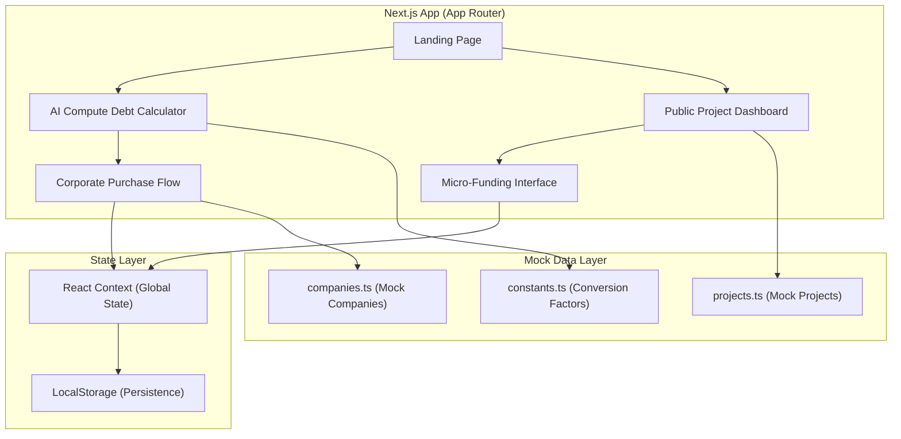
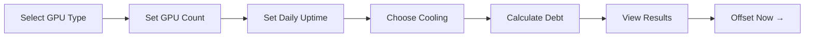
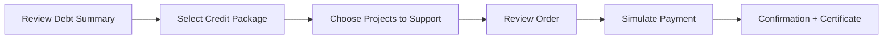
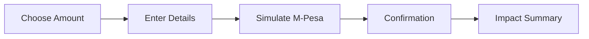

# TerraNode: Tokenizing Land Restoration to Offset AI Compute Footprint

> **Implementing agents:** See [AGENTS.md](./AGENTS.md) and [docs/IMPLEMENTATION_BRIEF.md](./docs/IMPLEMENTATION_BRIEF.md).

## 1. Problem Statement & Context

AI data centers are expanding aggressively, consuming arable land and water at scale. Current carbon-offset frameworks ignore this **physical footprint**. TerraNode bridges the gap by creating a marketplace where:

- **AI companies** can calculate and offset their "Arable Land Debt" by purchasing verified Land Restoration Credits.
- **The public** can crowdfund local land restoration projects, earning micro-ownership of restoration outcomes.

This MVP is a **high-fidelity functional prototype** for a hackathon demo — all transactions are simulated, but the UX must feel production-grade.

---

## 2. User Review Required

> [!IMPORTANT]
> **Tailwind CSS version**: The plan specifies Tailwind CSS & shadcn/ui. We will use **Tailwind CSS v4** (latest) with **shadcn/ui** (which requires React 18+). Please confirm you're okay with this, or if you'd prefer Tailwind v3 for stability.

> [!IMPORTANT]
> **Data source for projects**: The MVP uses hardcoded mock data for restoration projects. Should we pull from a JSON file, or inline the data directly in components? The plan below assumes a central `data/` directory with typed mock data files.

> [!WARNING]
> **No real payment processing**: All M-Pesa / payment flows are simulated with UI feedback only. No actual API calls or money movement.

---

## 3. Open Questions

1. **Branding**: Do you have a logo, color palette, or specific brand direction beyond "clean, technical, high-contrast"? The plan below proposes a dark-mode-first design with earth-tone accents (emerald green, warm amber, soil brown).
2. **Number of mock projects**: How many restoration projects should appear in the dashboard? (Plan assumes 6–8 diverse projects across different regions.)
3. **Demo flow priority**: For the hackathon presentation, which user journey is the "hero" flow — the corporate calculator → purchase, or the public micro-funding? This affects what we polish first.
4. **Deployment target**: Vercel for the demo? Or local-only?

---

## 4. Architecture Overview



### Tech Stack (Confirmed)

| Layer | Technology | Rationale |
|-------|-----------|-----------|
| Framework | Next.js 14+ (App Router) | SSR, file-based routing, rapid iteration |
| Language | TypeScript | Type safety for data models & calculations |
| Styling | Tailwind CSS + shadcn/ui | High-contrast, accessible components out of the box |
| State | React Context + LocalStorage | Simulate persistent transaction state without a backend |
| Charts | Recharts or Chart.js | Funding progress visualization |
| Animations | Framer Motion | Smooth transitions, micro-interactions |
| Icons | Lucide React | Consistent, clean iconography (ships with shadcn) |
| Deployment | Vercel (optional) | Zero-config Next.js hosting |

---

## 5. Data Models

### 5.1 Restoration Project

```typescript
interface RestorationProject {
  id: string;
  name: string;
  location: {
    region: string;
    country: string;
    coordinates: [number, number]; // [lat, lng]
  };
  description: string;
  category: 'agricultural' | 'wetland' | 'forest' | 'urban-green' | 'riparian';
  targetArea: number;           // square meters to restore
  restoredArea: number;         // square meters already restored
  fundingGoal: number;          // USD
  fundingRaised: number;        // USD
  costPerSqMeter: number;       // USD per m²
  status: 'funding' | 'in-progress' | 'verified' | 'completed';
  imageUrl: string;
  timeline: {
    startDate: string;
    estimatedCompletion: string;
  };
  backers: number;              // number of individual contributors
  verificationScore?: number;   // 0-100, simulated D-MRV score
}
```

### 5.2 Compute Debt Calculation

```typescript
interface ComputeProfile {
  gpuType: 'A100' | 'H100' | 'H200' | 'B200' | 'Custom';
  gpuCount: number;
  uptimeHoursPerDay: number;
  coolingType: 'air' | 'liquid' | 'hybrid';
  facilityLocation: string;
}

interface DebtResult {
  landFootprint: number;        // m² of arable land displaced
  waterConsumption: number;     // liters/year
  arableLandDebt: number;       // m² equivalent to offset
  estimatedCost: number;        // USD to offset via credits
  creditsToPurchase: number;    // number of restoration credits
}
```

### 5.3 Transaction (Simulated)

```typescript
interface Transaction {
  id: string;
  type: 'corporate-purchase' | 'micro-fund';
  timestamp: string;
  amount: number;               // USD
  creditsOrArea: number;        // credits purchased or m² funded
  projectId: string;
  buyerName: string;
  status: 'pending' | 'confirmed' | 'verified';
}
```

### 5.4 Conversion Constants

```typescript
// Core conversion factors (sourced from research estimates)
const CONVERSION = {
  // Average arable land displaced per GPU rack (m²)
  LAND_PER_GPU_RACK: 12.5,

  // Water consumption per GPU-hour (liters) — varies by cooling
  WATER_PER_GPU_HOUR: {
    air: 3.7,
    liquid: 1.2,
    hybrid: 2.4,
  },

  // Cost per m² of restoration credit (USD)
  CREDIT_COST_PER_SQM: 8.50,

  // 1 Restoration Credit = X m² of verified restored land
  SQM_PER_CREDIT: 100,

  // Facility overhead multiplier (parking, infrastructure, buffer zones)
  FACILITY_OVERHEAD: 2.3,
};
```

---

## 6. Proposed Changes — File Structure & Components

### Project Scaffolding

```
terranode/
├── public/
│   ├── images/                    # Project images, hero backgrounds
│   └── favicon.ico
├── src/
│   ├── app/
│   │   ├── layout.tsx             # Root layout, fonts, providers
│   │   ├── page.tsx               # Landing / Hero page
│   │   ├── calculator/
│   │   │   └── page.tsx           # AI Compute Debt Calculator
│   │   ├── corporate/
│   │   │   └── page.tsx           # Corporate Purchasing Flow
│   │   ├── projects/
│   │   │   ├── page.tsx           # Public Project Dashboard
│   │   │   └── [id]/
│   │   │       └── page.tsx       # Individual Project Detail + Fund
│   │   └── globals.css            # Tailwind base + custom tokens
│   ├── components/
│   │   ├── ui/                    # shadcn/ui components (Button, Card, etc.)
│   │   ├── layout/
│   │   │   ├── Navbar.tsx         # Global navigation bar
│   │   │   ├── Footer.tsx         # Site footer
│   │   │   └── PageWrapper.tsx    # Consistent page padding/transitions
│   │   ├── calculator/
│   │   │   ├── GpuSelector.tsx    # GPU type & count input
│   │   │   ├── UptimeSlider.tsx   # Hours/day uptime slider
│   │   │   ├── CoolingToggle.tsx  # Cooling type selector
│   │   │   ├── DebtDisplay.tsx    # Visual debt result (animated counters)
│   │   │   └── DebtChart.tsx      # Breakdown pie/bar chart
│   │   ├── corporate/
│   │   │   ├── CreditSelector.tsx # Choose credits to purchase
│   │   │   ├── CheckoutSummary.tsx# Order summary before purchase
│   │   │   ├── PaymentSim.tsx     # Simulated payment UI
│   │   │   └── ConfirmationModal.tsx # Success confirmation
│   │   ├── projects/
│   │   │   ├── ProjectCard.tsx    # Dashboard card with progress bar
│   │   │   ├── ProjectGrid.tsx    # Grid layout for all projects
│   │   │   ├── ProjectFilters.tsx # Category/status/region filters
│   │   │   ├── FundingProgress.tsx# Animated funding bar
│   │   │   └── ProjectMap.tsx     # Optional: simple map visualization
│   │   ├── funding/
│   │   │   ├── AmountPicker.tsx   # Preset amounts + custom input
│   │   │   ├── MpesaSim.tsx       # M-Pesa phone number simulation
│   │   │   ├── FundingReceipt.tsx # Post-funding receipt/confirmation
│   │   │   └── ImpactSummary.tsx  # "You restored X m²" display
│   │   └── shared/
│   │       ├── AnimatedCounter.tsx# Number count-up animation
│   │       ├── StatCard.tsx       # Reusable stat display card
│   │       ├── Badge.tsx          # Status/category badges
│   │       └── GlobeViz.tsx       # Optional: 3D globe with project pins
│   ├── context/
│   │   └── TerraNodeContext.tsx   # Global state provider
│   ├── data/
│   │   ├── projects.ts           # Mock restoration projects
│   │   ├── companies.ts          # Mock company profiles
│   │   └── constants.ts          # Conversion factors & config
│   ├── lib/
│   │   ├── calculator.ts         # Debt calculation logic (pure functions)
│   │   ├── formatters.ts         # Number/currency/area formatting
│   │   └── utils.ts              # cn() helper, misc utilities
│   └── types/
│       └── index.ts              # All TypeScript interfaces
├── components.json                # shadcn/ui configuration
├── tailwind.config.ts             # Tailwind customization
├── tsconfig.json
├── package.json
└── next.config.js
```

---

## 7. Feature Breakdown — Page by Page

### 7.1 Landing Page (`/`)

**Purpose**: Hero page that introduces TerraNode, establishes credibility, and funnels users to the two main flows.

| Element | Description |
|---------|-------------|
| Hero Section | Full-bleed dark gradient with animated particle/terrain effect. Tagline: *"Every GPU Has a Footprint. Restore It."* Two CTA buttons: **"Calculate Your Debt"** (→ `/calculator`) and **"Fund Restoration"** (→ `/projects`). |
| Problem Statement | Animated counter showing global stats: *"X million m² of arable land displaced by AI infrastructure this year"* |
| How It Works | 3-step visual: Calculate → Fund → Verify. Icons + short copy. |
| Live Stats Bar | Scrolling ticker: total m² restored, total backers, total credits issued (pulled from context/mock). |
| Featured Projects | 3 highlighted `ProjectCard` components from the dashboard. |
| Footer | Links, disclaimer ("hackathon prototype"), team credits. |

---

### 7.2 AI Compute Debt Calculator (`/calculator`)

**Purpose**: Interactive tool for AI companies to quantify their land impact.

#### User Flow



#### Inputs

| Input | Component | Details |
|-------|-----------|---------|
| GPU Type | `GpuSelector` | Dropdown: A100, H100, H200, B200, Custom. Each has a predefined power draw (W) and rack density factor. |
| GPU Count | Numeric stepper | Range: 1–100,000. Logarithmic scale option for large clusters. |
| Uptime | `UptimeSlider` | Slider: 0–24 hrs/day. Default: 20. |
| Cooling Type | `CoolingToggle` | Toggle: Air / Liquid / Hybrid. Affects water calculation. |

#### Calculation Logic (`lib/calculator.ts`)

```typescript
function calculateDebt(profile: ComputeProfile): DebtResult {
  const { gpuType, gpuCount, uptimeHoursPerDay, coolingType } = profile;

  // 1. Estimate physical rack count (8 GPUs per rack is industry standard)
  const rackCount = Math.ceil(gpuCount / 8);

  // 2. Direct land footprint (racks + overhead)
  const directLand = rackCount * CONVERSION.LAND_PER_GPU_RACK;
  const totalLand = directLand * CONVERSION.FACILITY_OVERHEAD;

  // 3. Water consumption (annual)
  const dailyWater = gpuCount * uptimeHoursPerDay * CONVERSION.WATER_PER_GPU_HOUR[coolingType];
  const annualWater = dailyWater * 365;

  // 4. Arable land debt (land + water-equivalent impact)
  // Water impact: 1000L ≈ 1m² of irrigated cropland per year
  const waterLandEquivalent = annualWater / 1000;
  const arableLandDebt = totalLand + waterLandEquivalent;

  // 5. Credits needed
  const creditsToPurchase = Math.ceil(arableLandDebt / CONVERSION.SQM_PER_CREDIT);
  const estimatedCost = arableLandDebt * CONVERSION.CREDIT_COST_PER_SQM;

  return {
    landFootprint: totalLand,
    waterConsumption: annualWater,
    arableLandDebt,
    estimatedCost,
    creditsToPurchase,
  };
}
```

#### Output Display (`DebtDisplay` + `DebtChart`)

- **Animated counters** rolling up to final numbers (land m², water L, cost $).
- **Donut chart**: Breakdown of debt by source (physical footprint vs. water impact).
- **Comparison callout**: *"That's equivalent to X football fields"* or *"enough water for Y households for a year"*.
- **CTA Button**: *"Offset This Debt →"* navigates to `/corporate` with the calculated debt pre-filled via URL params or context.

---

### 7.3 Corporate Purchasing Flow (`/corporate`)

**Purpose**: Simulated checkout for AI companies to buy restoration credits.

#### User Flow



#### Components

| Step | Component | Details |
|------|-----------|---------|
| 1. Debt Summary | `DebtDisplay` (reused) | Shows pre-calculated debt from calculator. Editable. |
| 2. Credit Packages | `CreditSelector` | Tiered packages: Bronze (25%), Silver (50%), Gold (75%), Platinum (100%). Shows m² restored per tier. |
| 3. Project Allocation | `ProjectCard` (selectable) | Allow companies to choose which projects their credits fund. Auto-allocate option. |
| 4. Order Review | `CheckoutSummary` | Line items: credits × cost, project breakdown, total. |
| 5. Payment | `PaymentSim` | Fake credit card / wire transfer UI. Animates "processing" for 2s, then confirms. |
| 6. Confirmation | `ConfirmationModal` | Certificate-style modal with: company name, credits purchased, m² restored, project names, timestamp, unique transaction ID. Downloadable as image/PDF. |

#### State Updates

On "purchase":
- Add transaction to `TerraNodeContext`
- Update `fundingRaised` on selected projects
- Persist to LocalStorage
- Show success toast + modal

---

### 7.4 Public Project Dashboard (`/projects`)

**Purpose**: Visual marketplace of all restoration projects with live funding progress.

#### Layout

- **Header**: Total stats bar (total projects, total m² being restored, total backers).
- **Filters**: `ProjectFilters` — filter by category, status, region. Search by name.
- **Grid**: `ProjectGrid` — responsive grid of `ProjectCard` components (3 columns desktop, 2 tablet, 1 mobile).

#### ProjectCard Design

```
┌─────────────────────────────────┐
│  [Project Image]                │
│                                 │
│  🏷️ Category Badge    📍 Region │
│                                 │
│  Project Name                   │
│  Short description...           │
│                                 │
│  ████████████░░░░  72% funded   │
│  $36,000 / $50,000              │
│                                 │
│  👥 142 backers  📐 5,000 m²    │
│                                 │
│  [ Fund This Project → ]        │
└─────────────────────────────────┘
```

#### Project Detail Page (`/projects/[id]`)

- Full project description, larger image/gallery.
- Detailed funding breakdown (timeline chart of funding over time).
- Map showing project location.
- List of recent backers (anonymized or mock names).
- `AmountPicker` + `MpesaSim` for funding inline.
- Impact calculator: *"$10 restores 1.2 m² of degraded farmland"*.

---

### 7.5 Retail Micro-Funding Interface (within `/projects/[id]`)

**Purpose**: Streamlined flow for the public to contribute small amounts.

#### User Flow



#### Components

| Component | Details |
|-----------|---------|
| `AmountPicker` | Preset buttons: $5, $10, $25, $50, $100, Custom. Shows instant impact: *"$25 = 2.9 m² restored"*. |
| `MpesaSim` | Phone number input (Kenyan format: +254...). Simulated STK push prompt UI. "Enter PIN" modal. 3s processing animation. |
| `FundingReceipt` | Transaction ID, amount, project, m² funded, timestamp. Shareable (copy link). |
| `ImpactSummary` | Celebratory animation. *"🌱 You just restored 2.9 m² of farmland in Nakuru County!"* Running total of user's contributions (from LocalStorage). |

---

## 8. UI/UX Design Direction

### Color Palette

| Token | Value | Usage |
|-------|-------|-------|
| `--bg-primary` | `#0a0f0d` | Dark background (near-black with green undertone) |
| `--bg-secondary` | `#141f1a` | Card backgrounds, elevated surfaces |
| `--bg-tertiary` | `#1e2e26` | Hover states, active elements |
| `--accent-green` | `#34d399` | Primary CTA, success states, progress bars |
| `--accent-amber` | `#fbbf24` | Warnings, highlights, secondary actions |
| `--accent-earth` | `#a0826d` | Earthy accent for restoration imagery |
| `--text-primary` | `#f0fdf4` | Main text (green-white) |
| `--text-secondary` | `#86efac` | Subtle text, labels |
| `--text-muted` | `#4ade80` | Muted text, placeholders |
| `--border` | `#1e3a2f` | Subtle borders |

### Typography

- **Headings**: `Space Grotesk` (technical, modern)
- **Body**: `Inter` (clean, highly legible)
- **Mono/Data**: `JetBrains Mono` (for numbers, calculations)

### Motion & Animation

- **Page transitions**: Framer Motion `AnimatePresence` with fade + slide.
- **Number counters**: Count-up animation on scroll-into-view.
- **Progress bars**: Animated fill with subtle pulse on hover.
- **Cards**: Lift + border-glow on hover.
- **Loading states**: Skeleton loaders with shimmer effect.
- **Success states**: Confetti burst on purchase/funding confirmation.

### Responsive Breakpoints

| Breakpoint | Width | Layout |
|-----------|-------|--------|
| Mobile | < 640px | Single column, stacked cards |
| Tablet | 640–1024px | 2-column grid |
| Desktop | > 1024px | 3-column grid, side panels |

---

## 9. State Management

### TerraNodeContext

```typescript
interface TerraNodeState {
  // Calculator
  currentDebt: DebtResult | null;
  computeProfile: ComputeProfile | null;

  // Projects
  projects: RestorationProject[];

  // Transactions
  transactions: Transaction[];
  totalCreditsIssued: number;
  totalAreaRestored: number;
  totalFundsRaised: number;

  // User (simulated)
  userContributions: Transaction[];
}
```

### LocalStorage Keys

| Key | Data | Purpose |
|-----|------|---------|
| `terranode-projects` | `RestorationProject[]` | Persist updated funding amounts |
| `terranode-transactions` | `Transaction[]` | Transaction history |
| `terranode-debt` | `DebtResult` | Last calculated debt |
| `terranode-user` | `{ name, contributions }` | Simulated user session |

---

## 10. Mock Data Requirements

### Restoration Projects (8 projects)

| # | Name | Category | Region | Funding Goal |
|---|------|----------|--------|-------------|
| 1 | Nakuru Lakeside Buffer | agricultural | Nakuru, Kenya | $50,000 |
| 2 | Tana Delta Wetland Revival | wetland | Tana River, Kenya | $75,000 |
| 3 | Mau Forest Edge Reforestation | forest | Kericho, Kenya | $120,000 |
| 4 | Nairobi Urban Greenbelt | urban-green | Nairobi, Kenya | $35,000 |
| 5 | Ewaso Nyiro Riparian Corridor | riparian | Laikipia, Kenya | $60,000 |
| 6 | Machakos Dryland Restoration | agricultural | Machakos, Kenya | $40,000 |
| 7 | Kisumu Wetland Conservation | wetland | Kisumu, Kenya | $55,000 |
| 8 | Mt. Kenya Buffer Zone | forest | Nyeri, Kenya | $90,000 |

Each project will have varied `fundingRaised` (30–85% of goal), realistic descriptions, and generated images.

---

## 11. Build Order — Phased Execution

### Phase 1: Foundation (Est. 1–2 hours)

- [x] Initialize Next.js project with TypeScript
- [ ] Install dependencies: Tailwind CSS, shadcn/ui, Framer Motion, Recharts, Lucide
- [ ] Configure Tailwind with custom color tokens
- [ ] Set up shadcn/ui (`npx shadcn@latest init`)
- [ ] Create types (`types/index.ts`)
- [ ] Create constants (`data/constants.ts`)
- [ ] Create mock data (`data/projects.ts`, `data/companies.ts`)
- [ ] Build `TerraNodeContext` with LocalStorage persistence
- [ ] Build shared components: `Navbar`, `Footer`, `PageWrapper`, `AnimatedCounter`, `StatCard`, `Badge`

### Phase 2: Calculator (Est. 1–2 hours)

- [ ] Build `GpuSelector`, `UptimeSlider`, `CoolingToggle`
- [ ] Implement `calculator.ts` logic with unit tests
- [ ] Build `DebtDisplay` with animated counters
- [ ] Build `DebtChart` (donut/bar chart)
- [ ] Wire up calculator page with state management
- [ ] Add "Offset Now" CTA linking to corporate flow

### Phase 3: Corporate Flow (Est. 1–1.5 hours)

- [ ] Build `CreditSelector` with tiered packages
- [ ] Build `CheckoutSummary`
- [ ] Build `PaymentSim` with fake processing animation
- [ ] Build `ConfirmationModal` with certificate design
- [ ] Wire state updates (transactions, project funding)

### Phase 4: Dashboard & Funding (Est. 1.5–2 hours)

- [ ] Build `ProjectCard` with progress bar
- [ ] Build `ProjectGrid` with responsive layout
- [ ] Build `ProjectFilters` (category, status, search)
- [ ] Build project detail page (`/projects/[id]`)
- [ ] Build `AmountPicker` with instant impact display
- [ ] Build `MpesaSim` with STK push simulation
- [ ] Build `FundingReceipt` and `ImpactSummary`

### Phase 5: Landing Page & Polish (Est. 1–1.5 hours)

- [ ] Build hero section with animated background
- [ ] Build "How It Works" section
- [ ] Build live stats ticker
- [ ] Build featured projects section
- [ ] Add page transitions (Framer Motion)
- [ ] Responsive testing across all breakpoints
- [ ] Final visual polish: hover effects, loading states, edge cases

---

## 12. Post-Hackathon Roadmap

| Feature | Priority | Complexity | Dependencies |
|---------|----------|-----------|--------------|
| Real M-Pesa via Daraja API | 🔴 High | Medium | Safaricom developer account, Node.js backend |
| D-MRV satellite integration | 🔴 High | High | Satellite imagery API (Planet, Sentinel), ML pipeline |
| Cloud provider oracles | 🟡 Medium | High | AWS/Azure/GCP API partnerships |
| On-chain credit minting (Celo) | 🟡 Medium | High | Celo SDK, smart contract development |
| User authentication | 🟡 Medium | Low | NextAuth.js or Clerk |
| Admin dashboard | 🟢 Low | Medium | Role-based access, project management CRUD |
| Mobile app (React Native) | 🟢 Low | High | Shared type definitions, API layer |

---

## 13. Verification Plan

### Automated Checks

- **TypeScript compilation**: `npx tsc --noEmit` — zero errors.
- **Dev server**: `npm run dev` — no console errors, all pages render.
- **Responsive**: Test at 375px (mobile), 768px (tablet), 1440px (desktop).

### Manual Verification

- **Calculator flow**: Input → calculate → animated results → navigate to purchase.
- **Corporate flow**: Select tier → choose projects → fake payment → confirmation modal.
- **Public flow**: Browse projects → filter → select project → fund → receipt.
- **State persistence**: Refresh browser — transactions and funding progress persist.
- **Edge cases**: 0 GPUs, max GPUs (100k), $0 funding, negative inputs.

### Demo Script (Hackathon)

1. Open landing page → scroll through hero and stats.
2. Click "Calculate Your Debt" → configure 1,000 H100s at 22hrs/day → see results.
3. Click "Offset Now" → choose Gold tier → select 2 projects → purchase → see certificate.
4. Navigate to Projects → filter by "agricultural" → click Nakuru project.
5. Fund $25 via M-Pesa simulation → see impact summary.
6. Return to landing page → observe updated live stats.
